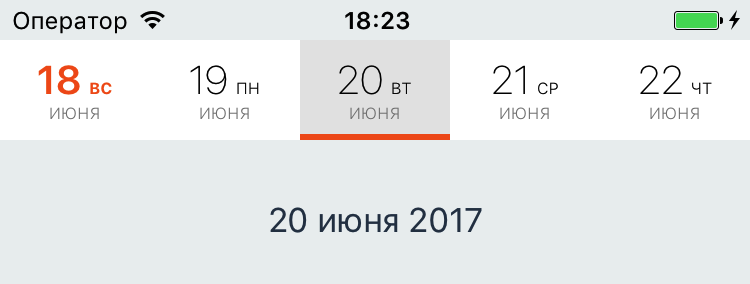

ScrollableDatepicker
============

<p align="left">
	<a href="https://developer.apple.com/swift"></a>
	<a href="https://cocoapods.org/pods/ScrollableDatepicker"></a>
	
	<a href="https://raw.githubusercontent.com/maxsokolov/tablekit/master/LICENSE"></a>
</p>


## Getting Started

An [example ViewController](https://github.com/noxt/ScrollableDatepicker/blob/master/ScrollableDatepicker/PresentationLayer/ViewController.swift) is included demonstrating ScrollableDatepicker's functionality.

## Installation

### CocoaPods

Add the following line to your Podfile:

```ruby
pod 'ScrollableDatepicker', '~> 2.2'
```

Then run the following in the same directory as your Podfile:
```ruby
pod install
```

### Manual

Clone the repo and drag files from `Sources` folder into your Xcode project.


## Configuration

### Day Style Configuration


You can customize following properties for each state (default, weekend, selected):

- Font & Color for day, week day and month
- Background Color for cell
- Selector Color

Depending on the state of the cell, its style is composed of the default and appropriate styles.


### Data Configuration

- Number of dates in one screen


### Example



```swift
var configuration = Configuration()

// weekend customization
configuration.weekendDayStyle.dateTextColor = UIColor(red: 242.0/255.0, green: 93.0/255.0, blue: 28.0/255.0, alpha: 1.0)
configuration.weekendDayStyle.dateTextFont = UIFont.boldSystemFont(ofSize: 20)
configuration.weekendDayStyle.weekDayTextColor = UIColor(red: 242.0/255.0, green: 93.0/255.0, blue: 28.0/255.0, alpha: 1.0)

// selected date customization
configuration.selectedDayStyle.backgroundColor = UIColor(white: 0.9, alpha: 1)
configuration.daySizeCalculation = .numberOfVisibleItems(5)

datepicker.configuration = configuration

```


## Requirements

- iOS 9.0
- Xcode 8.0


## License

ScrollableDatepicker is available under the MIT license. See LICENSE for details.